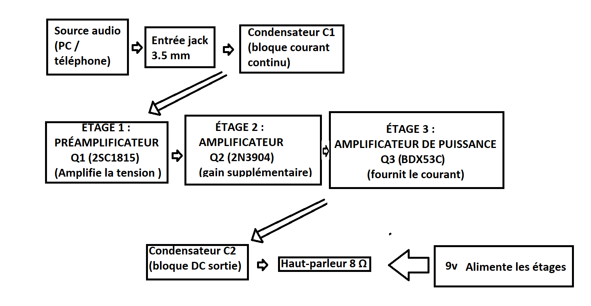
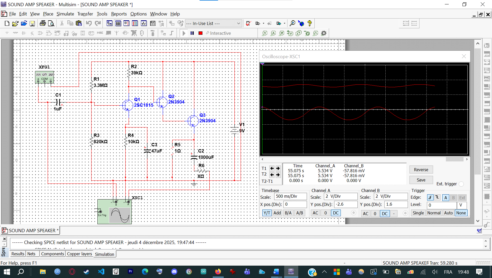

# 3-Stage Discrete Transistor Audio Amplifier

> Common-emitter preamp (2SC1815) → emitter-follower buffer (2N3904) → Darlington power stage (BDX53C)  
> **44.3 dB voltage gain · 20 Hz – 20 kHz · 9 V DC · 8 Ω speaker**  
> La Cité collégiale — Transistors (TEC27910) · Fall 2025

---

## Overview

I designed and built a fully discrete 3-stage audio amplifier to drive an **8 Ω speaker** from a 3.5 mm audio source. I analyzed each stage with **DC bias-point and AC small-signal calculations** before assembly, simulated the full circuit in **Multisim**, then built and validated the design on breadboard with an oscilloscope.

The amplifier achieves **~44.3 dB of voltage gain** across the full audio bandwidth (20 Hz – 20 kHz), exceeding the 40 dB target in the design brief.

---

## What I Built

- **Designed** the 3-stage architecture from scratch: common-emitter preamp → emitter-follower buffer → Darlington power stage
- **Calculated** the DC bias point for Q1: Vb, Ve, Ic, Vc, Vce, and dynamic emitter resistance (re)
- **Calculated** AC voltage gain: G1 = Rc / re = 163.6 (~44.3 dB) — verified against the 40 dB target
- **Designed** the input and output coupling capacitors (C1, C2) and emitter bypass capacitor (C3) for full audio bandwidth coverage
- **Simulated** the complete circuit in Multisim — verified bias point, gain, bandwidth, and THD before breadboard assembly
- **Assembled** the circuit on breadboard and connected a 3.5 mm audio jack as the input source
- **Tested** audio output quality by driving an 8 Ω speaker with music from a smartphone
- **Measured** voltage gain and bandwidth using an oscilloscope at multiple frequencies
- **Troubleshot** Q3 thermal saturation — identified the root cause, substituted the BDX53C Darlington, and added R5 (1 Ω) current-limiting resistor
- **Verified** the fix with the oscilloscope — captured waveforms before and after every corrective change
- **Validated** final performance: 44.3 dB gain, 20 Hz – 20 kHz bandwidth, THD < 5 %
- **Documented** the full design in a technical report including theory, calculations, simulation results, and test data

---

## Design Criteria

### Functional Requirements

| # | Requirement | Met |
|---|---|---|
| 1 | Amplify audio signal from 3.5 mm jack (smartphone / PC) | ✅ |
| 2 | Voltage gain ≥ 40 dB | ✅ 44.3 dB |
| 3 | Drive an 8 Ω speaker | ✅ |
| 4 | Bandwidth: 20 Hz – 20 kHz (full audio band) | ✅ |
| 5 | Minimum 2-stage amplification | ✅ 3 stages |
| 6 | Output voltage proportional to input voltage (linearity) | ✅ |
| 7 | Verifiable by oscilloscope and DMM | ✅ |

### Non-Functional Requirements

- Low noise for good audio quality
- THD < 5 % at nominal power
- Circuit stable during operation — no audio drop-outs
- Q3 must not overheat excessively
- Standard, replaceable components

---

## Block Diagram



*Signal flow: Audio source → 3.5 mm jack → C1 (DC block) → Q1 2SC1815 (voltage gain) → Q2 2N3904 (buffer) → Q3 BDX53C (power) → C2 (DC block) → 8 Ω speaker. 9 V supply powers all three stages.*

---

## Schematic & Simulation (Multisim)



**Oscilloscope readout:**
- **Channel A** (output) — amplified signal, ~5.5 V scale
- **Channel B** (input) — source signal, ~57.8 mV scale
- Gain visually confirmed: output waveform significantly larger than input
- Both channels sinusoidal — no clipping or visible distortion at nominal level
- Timebase: 500 ms/div

> **Note on Q3 in Multisim:** Q3 appears as `2N3904` in the simulation because the BDX53C Darlington is not in the default Multisim library. The 2N3904 was used as a functional substitute for simulation only. The physical build uses the **BDX53C**.

---

## Stage-by-Stage Design

### Stage 1 — Q1 (2SC1815) · Common-Emitter Preamp

I chose the **2SC1815** for its low noise figure and suitability for small-signal audio preamplification. Common-emitter configuration gives maximum voltage gain.

**DC Bias Calculations:**

| Parameter | Formula | Value |
|---|---|---|
| Vb | Vcc × R3 / (R1 + R3) = 9 × 820k / (3.3M + 820k) | **1.79 V** |
| Ve | Vb − 0.7 | **1.09 V** |
| Ie | Ve / R4 = 1.09 / 10k | **109.1 µA** |
| Ic | ≈ Ie | **109.1 µA** |
| Vc | Vcc − Ic × R2 = 9 − (109.1µ × 39k) | **4.74 V** |
| Vce | Vc − Ve = 4.74 − 1.09 | **3.65 V** |
| re | 25 mV / Ie = 25m / 109.1µ | **238.3 Ω** |

**AC Gain:**

```
G1 = Rc / re = 39 kΩ / 238.3 Ω ≈ 163.6   →   44.3 dB
```

**C3 (47 µF)** bypasses R4 at AC frequencies — removes emitter degeneration and maximizes gain without disturbing the DC bias point.

**Component justification:**
- R1 (3.3 MΩ) / R3 (820 kΩ): voltage divider sets a stable base voltage — reduces distortion and thermal drift
- R4 (10 kΩ): emitter resistor stabilizes quiescent current against temperature
- R2 (39 kΩ): collector load — large enough for high gain without saturating Q1

### Stage 2 — Q2 (2N3904) · Emitter-Follower Buffer

I configured Q2 as a **collector-common (emitter-follower)**:
- Voltage gain ≈ 1 — no additional voltage amplification
- **High input impedance** — does not load Stage 1 and degrade gain
- **Low output impedance** — drives Stage 3 base without signal loss

### Stage 3 — Q3 (BDX53C) · Darlington Power Output Stage

I chose the **BDX53C** NPN Darlington in **collector-common** configuration:
- Very high current gain (β₁ × β₂) — delivers sufficient current into the 8 Ω load
- Protection diode on base prevents reverse-bias breakdown
- **R5 (1 Ω):** limits collector current and protects against thermal runaway

**Low-frequency cutoff (C2 = 1000 µF):**

```
Fl = 1 / (2π × C2 × R_speaker) = 1 / (2π × 1000µF × 8Ω) ≈ 20 Hz
```

---

## Total Gain Summary

| Stage | Configuration | Voltage Gain |
|---|---|---|
| Q1 — 2SC1815 | Common-emitter | 163.6 (44.3 dB) |
| Q2 — 2N3904 | Emitter-follower | ≈ 1 |
| Q3 — BDX53C | Emitter-follower (Darlington) | ≈ 1 |
| **Total** | | **163.6 × 1 × 1 = 163.6 ≈ 44.3 dB** |

> Target was 40 dB — **specification exceeded.**

---

## Bill of Materials

| Ref | Component | Value | Role |
|---|---|---|---|
| Q1 | 2SC1815 NPN | — | Common-emitter voltage preamp |
| Q2 | 2N3904 NPN | — | Emitter-follower buffer |
| Q3 | BDX53C NPN Darlington | — | Power output stage |
| C1 | Input coupling cap | 1 µF | Blocks DC from audio source |
| C2 | Output coupling cap | 1000 µF | Blocks DC from speaker; sets Fl = 20 Hz |
| C3 | Emitter bypass cap | 47 µF | Removes AC degeneration from R4; maximizes Stage 1 gain |
| R1 | Bias resistor | 3.3 MΩ | Upper voltage divider for Q1 base |
| R3 | Bias resistor | 820 kΩ | Lower voltage divider for Q1 base |
| R2 | Collector load | 39 kΩ | Sets Stage 1 voltage gain (Rc) |
| R4 | Emitter resistor | 10 kΩ | DC stability / thermal bias stabilization |
| R5 | Current limit | 1 Ω | Protects Q3 from overcurrent / thermal runaway |
| R6 | Speaker | 8 Ω | Output transducer (load) |
| VCC | Supply | 9 V DC | Powers all stages |

---

## Simulation Results (Multisim)

| Parameter | Simulated | Target | Pass |
|---|---|---|---|
| Vb (Q1) | 1.79 V | 1.79 V (calc.) | ✅ |
| Vce (Q1) | 3.66 V | 3.65 V (calc.) | ✅ |
| re (Q1) | 238 Ω | 238.3 Ω (calc.) | ✅ |
| Voltage gain G1 | 164 (44 dB) | ≥ 40 dB | ✅ |
| Bandwidth | 20 Hz – 20 kHz | 20 Hz – 20 kHz | ✅ |
| THD | < 5 % at nominal power | < 5 % | ✅ |

---

## Problems Encountered & Solutions

| Problem | Root Cause | Solution Applied | Verified |
|---|---|---|---|
| Q3 thermal saturation / overheating | Output transistor dissipating too much power | Replaced with BDX53C Darlington; added R5 (1 Ω) current-limit resistor | Oscilloscope — waveform before/after |
| Distortion / crackling at high volume | Input signal too large → Q1 driven into saturation | Reduced input level to keep Q1 in active region | Oscilloscope — clean sine confirmed |

---

## Development Log

| Week | Dates | Activity |
|---|---|---|
| 1 | Nov 10–17, 2025 | Design brief; target specs defined; 3-stage architecture chosen; component selection and justification |
| 2 | Nov 17–24, 2025 | DC bias calculated; Multisim simulation built; gain (44 dB) and bandwidth verified |
| 3 | Nov 24 – Dec 1, 2025 | Breadboard assembly; bench testing; Q3 overheating issue encountered and resolved |
| 4 | Dec 1–8, 2025 | Final validation; report written; documentation completed |

---

## References

- Malvino & Bates, *Electronic Principles*, 8th ed.
- Toshiba Corporation — 2SC1815 Datasheet
- STMicroelectronics — [BDX53C Datasheet](https://www.digikey.ca/fr/products/detail/stmicroelectronics/BDX53C/1852123)

---

## Skills Demonstrated

`Transistor biasing (voltage divider)` `DC operating point analysis` `AC small-signal analysis` `Common-emitter amplifier` `Emitter-follower` `Darlington power stage` `Coupling and bypass capacitor design` `Thermal management` `Multisim simulation` `Oscilloscope validation` `Audio electronics` `Fault isolation` `Component substitution`

---

## Author & Usage Notice

This project was designed, built, tested, and documented by Adam Zaghloul as part of an Electronics Engineering Technology portfolio.

This repository is shared publicly for portfolio review and educational reference only. You may not copy, redistribute, modify, or present this work, documentation, images, schematics, code, or design files as your own without written permission.

Copyright © 2026 Adam Zaghloul. All rights reserved.

---

*Adam Zaghloul · La Cité collégiale · Fall 2025 · [adamzaghloul07@gmail.com](mailto:adamzaghloul07@gmail.com)*
